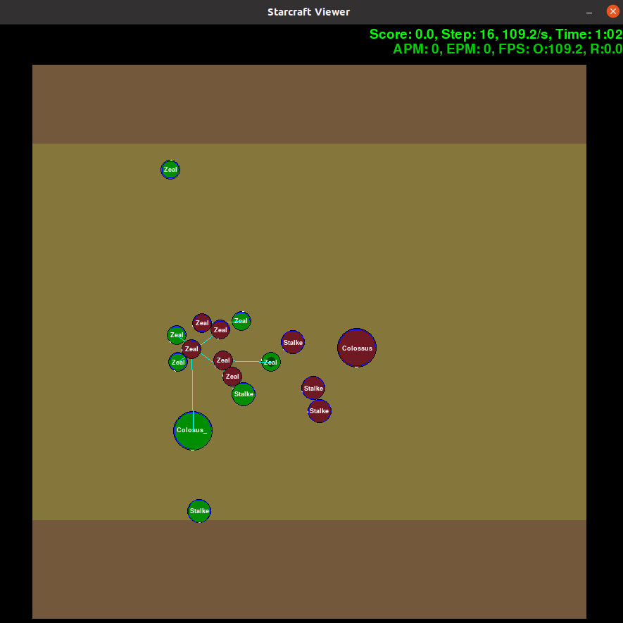

# Multi-Agent Reinforcement Learning Algorithms in StarCraft II Environment

Deepmind에서 제공하는 스타크래프트2 학습 환경인 [PySC2](https://github.com/deepmind/pysc2) 를 기반으로 제작된 StarCraft Multi-Agent Challenge([SMAC](https://github.com/oxwhirl/smac)) 환경에서 최신 주요 Multi-Agent Reinforcement Learning(MARL) 알고리즘을 구현하고 실험 검증해보도록 합니다. SMAC 환경에 대한 자세한 내용은 WhiRL의 [blog post](http://whirl.cs.ox.ac.uk/blog/smac/) 를 참고하시길 바랍니다.

스타크래프트2는 안타깝게도 Linux 환경에서의 플레이를 공식적으로 지원하지 않으므로 렌더링을 하는 것이 까다롭습니다. 따라서 OpenAI Gym의 Multi-Agent 버전인 [PettingZoo](https://github.com/PettingZoo-Team/PettingZoo) 를 활용하여 학습 과정 렌더링에 사용해보도록 하겠습니다.



Fig. 1 SMAC 환경 내 1c3s5z 맵을 PettingZoo를 이용하여 렌더링한 플레이 영상.

## 구현 알고리즘 목록

- [QMIX: Monotonic Value Function Factorisation for Deep Multi-Agent Reinforcement Learning](https://arxiv.org/abs/1803.11485) - 진행 중
- [DOP: Off-Policy Multi-Agent Decomposed Policy Gradients](https://openreview.net/forum?id=6FqKiVAdI3Y) - 예정

## 설치 및 실행 방법

### 1. StarCraft2 다운로드

우선 Linux 전용 스타크래프트2 패키지를 다운습니다. SMAC에서는 SC2.4.6.2 버전을 사용했기 때문에 그대로 따랐으나, 다른 최신 버전을 원한다면 [Blizzrd github](https://github.com/Blizzard/s2client-proto#linux-packages) 에서 직접 원하는 버전을 다운로드 받을 수 있습니다. PySC2의 기본 스타크래프트 경로인 `~/StarCraftII/` 를 따르도록 설치하겠습니다.
```bash
cd ~
wget http://blzdistsc2-a.akamaihd.net/Linux/SC2.4.6.2.69232.zip
unzip -P iagreetotheeula SC2.4.6.2.69232.zip
```
또한 실행에 필요한 맵을 다운로드 받습니다.
```bash
cd ~/StarCraftII/Maps
wget https://github.com/oxwhirl/smac/releases/download/v0.1-beta1/SMAC_Maps.zip
unzip SMAC_Maps.zip
```

### 2. Clone 및 환경 설정

원하는 경로로 이동 후 레포지토리를 clone합니다. 본 레포지토리는 [SMAC](https://github.com/oxwhirl/smac) 에서 제공하는 StarCraft2 환경을 포함하고 있습니다.
```bash
cd CHANGE/TO/YOUR/PATH
git clone https://github.com/Taewoo-Kang/marl-in-sc2.git
```
이후 필요한 패키지를 다운로드 받습니다. 만일을 위해 파이썬 가상환경을 사용하는 것을 추천합니다.
```bash
cd marl-in-sc2
pip install -r requirements.txt
```

### 3. 코드 실행

본격적인 코드 실행에 앞서 실행 가능한 맵 목록을 확인해봅니다. 출력 결과로 맵 이름, 자신의 Agent의 수, 적의 수, 에피소드의 길이를 알 수 있습니다.
```bash
python -m smac.bin.map_list
```
원하는 맵 이름을 `--map` 인자의 값으로 넣어주어 실행합니다. 인자 누락시에는 기본값으로 3m으로 설정되어 실행됩니다.
```bash
python main.py --map 3m
```